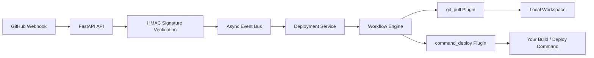

# BuildClaw

[English](./README.md) | [简体中文](./README.zh-CN.md)

> [!IMPORTANT]
> BuildClaw is currently an early-stage deployment backend prototype.
> The working path implemented today is:
> `GitHub Webhook -> signature verification -> async event dispatch -> git pull -> deployment command execution`.

BuildClaw is a FastAPI-based auto-deployment service designed to receive GitHub webhook events, synchronize repository code to a local workspace, and execute project-specific deployment commands in a controlled, observable way.

The current codebase focuses on a clean and extensible backend foundation:

- FastAPI HTTP entrypoint for GitHub webhook handling
- HMAC-SHA256 signature verification for GitHub webhooks
- In-process async event bus for decoupled orchestration
- `git_pull` plugin for repository synchronization
- `command_deploy` plugin for command-based deployment flows
- Branch-based deployment rules with exact and wildcard matching

## Table of Contents

- [Why BuildClaw](#why-buildclaw)
- [Current Scope](#current-scope)
- [Architecture](#architecture)
- [Repository Layout](#repository-layout)
- [Quick Start](#quick-start)
- [Configuration](#configuration)
- [GitHub Webhook Setup](#github-webhook-setup)
- [Detailed Deployment Guide](#detailed-deployment-guide)
- [Operations and Troubleshooting](#operations-and-troubleshooting)
- [Security Recommendations](#security-recommendations)
- [Roadmap](#roadmap)

## Why BuildClaw

Many deployment tools are either too platform-specific or too opinionated for teams that want to control their own deployment commands. BuildClaw takes a simpler approach:

- keep the webhook intake predictable
- keep repository synchronization explicit
- keep deployment execution configurable
- keep the orchestration layer extensible for future plugins such as Docker, Kubernetes, or VM-based deployment

This makes BuildClaw a good fit when you want a lightweight deployment control plane without immediately committing to a large platform stack.

## Current Scope

### What works now

- `POST /webhooks/github/{repo_id}`
- GitHub `push` event handling
- GitHub `ping` event response
- branch rule resolution
- local repository checkout into a workspace directory
- checkout to the exact commit from webhook payload
- configurable deployment command execution
- structured application logging
- `/healthz` health endpoint

### What is planned but not implemented yet

- persistent deployment history
- rollback workflow
- approval flow
- Docker and Kubernetes deployer plugins
- real-time deployment log streaming to frontend clients
- multi-node event transport such as Redis Streams or Kafka

## Architecture



### Request and execution flow

1. GitHub sends a `push` webhook request to BuildClaw.
2. BuildClaw validates `X-Hub-Signature-256`.
3. The request is converted into an internal deployment trigger.
4. The deployment service resolves the matching branch policy.
5. The workflow engine runs `git_pull` first.
6. After the repository is synchronized, `command_deploy` runs your configured deployment command.
7. Logs are written through the application logger for inspection and debugging.

## Repository Layout

```text
.
|-- backend/
|   |-- app/
|   |   |-- core/          # infrastructure primitives: event bus, workflow, process helpers
|   |   |-- plugins/       # deployment step plugins
|   |   |-- services/      # deployment orchestration and repository resolution
|   |   |-- config.py      # typed config loading and validation
|   |   `-- main.py        # FastAPI application entrypoint
|   |-- config.yaml        # active runtime config
|   |-- config.example.yaml
|   `-- pyproject.toml
|-- README.md
`-- README.zh-CN.md
```

## Quick Start

### Prerequisites

- Python `3.11+`
- `git` installed and available in `PATH`
- outbound access from the deployment server to your Git provider
- inbound access from GitHub to your webhook endpoint
- OpenSSH client available if you plan to use SSH key authentication

### 1. Clone the repository

```bash
git clone https://github.com/rockmelodies/buildclaw.git
cd buildclaw
```

### 2. Install backend dependencies

```bash
cd backend
python -m pip install -e .
```

### 3. Prepare configuration

Use the shipped config as a starting point:

```bash
cp config.example.yaml config.yaml
```

Then edit `config.yaml`:

- set `webhook_secret`
- set repository authentication
- adjust branch rules
- replace the sample deploy command with your real build or deployment command

### 4. Start the service

```bash
uvicorn app.main:app --host 0.0.0.0 --port 8080
```

### 5. Verify the service

```bash
curl http://127.0.0.1:8080/healthz
```

Expected response:

```json
{"status":"ok"}
```

## Configuration

The backend reads `backend/config.yaml` by default. You can override it with:

```bash
BUILDCLAW_CONFIG=/path/to/config.yaml
```

### Configuration structure

```yaml
server:
  address: "0.0.0.0"
  port: 8080

workspace_root: "./workspace"

repositories:
  - id: "buildclaw"
    name: "buildclaw"
    git_url: "https://github.com/rockmelodies/buildclaw.git"
    webhook_secret: "replace-me"
    auth:
      https_username: "git"
      https_token: ""
      ssh_private_key_base64: ""
    branches:
      - pattern: "main"
        steps:
          - name: "deploy-main"
            plugin: "command_deploy"
            config:
              command: ["go", "test", "./..."]
              working_dir: "backend"
              timeout_sec: 300
      - pattern: "feature/*"
        steps:
          - name: "preview-check"
            plugin: "command_deploy"
            config:
              command: ["go", "test", "./..."]
              working_dir: "backend"
              timeout_sec: 300
```

### Branch rule behavior

BuildClaw resolves branch rules in this order:

1. exact match, for example `main`
2. longest prefix wildcard, for example `feature/*`
3. global wildcard `*`

### Deployment step behavior

Every deployment currently starts with an implicit `git_pull` step generated by the service layer. The `steps` you configure under each branch are appended after code synchronization succeeds.

## GitHub Webhook Setup

### 1. Choose a webhook secret

Generate a strong secret and place the same value in:

- `backend/config.yaml` -> `repositories[].webhook_secret`
- GitHub repository settings -> Webhooks -> Secret

Example:

```bash
python - <<'PY'
import secrets
print(secrets.token_urlsafe(48))
PY
```

### 2. Configure the webhook in GitHub

In your GitHub repository:

1. Open `Settings`
2. Open `Webhooks`
3. Click `Add webhook`
4. Set `Payload URL` to:

```text
https://your-domain.example.com/webhooks/github/buildclaw
```

5. Set `Content type` to `application/json`
6. Set the secret value
7. Select `Just the push event`
8. Save the webhook

### 3. Validate delivery

GitHub should receive:

- `200 OK` for `ping`
- `202 Accepted` for valid `push` events

### 4. Manual local webhook test

You can manually generate a valid GitHub-style signature:

```bash
python - <<'PY'
import hmac
import json
from hashlib import sha256

secret = b"replace-me"
payload = json.dumps({
    "ref": "refs/heads/main",
    "after": "1234567890abcdef1234567890abcdef12345678"
}).encode()

signature = "sha256=" + hmac.new(secret, payload, sha256).hexdigest()
print(payload.decode())
print(signature)
PY
```

Then send it with `curl`:

```bash
curl -X POST "http://127.0.0.1:8080/webhooks/github/buildclaw" \
  -H "Content-Type: application/json" \
  -H "X-GitHub-Event: push" \
  -H "X-Hub-Signature-256: sha256=YOUR_SIGNATURE" \
  -d '{"ref":"refs/heads/main","after":"1234567890abcdef1234567890abcdef12345678"}'
```

## Detailed Deployment Guide

### Deployment model

BuildClaw does not yet include a dedicated Docker or Kubernetes deployment plugin. Instead, it executes your own deployment command through `command_deploy`. This gives you flexibility:

- run tests
- build artifacts
- restart services
- invoke Ansible, Fabric, shell scripts, or custom release tooling

### Recommended production setup

For a production-like Linux deployment, use:

- a dedicated Linux user such as `buildclaw`
- a Python virtual environment
- a reverse proxy such as Nginx or Caddy
- a systemd service for process supervision
- a persistent workspace directory

### Step 1. Create a dedicated user

```bash
sudo useradd --create-home --shell /bin/bash buildclaw
sudo su - buildclaw
```

### Step 2. Clone the project on the server

```bash
git clone https://github.com/rockmelodies/buildclaw.git
cd buildclaw/backend
python3 -m venv .venv
source .venv/bin/activate
python -m pip install --upgrade pip
python -m pip install -e .
```

### Step 3. Prepare runtime configuration

Edit `backend/config.yaml` carefully:

- set the right repository `id`
- point `git_url` to the application repository you want to deploy
- set a secure `webhook_secret`
- configure either HTTPS token or SSH private key
- set `workspace_root` to a writable persistent path
- replace the sample deployment command

Example deployment command:

```yaml
steps:
  - name: "deploy-main"
    plugin: "command_deploy"
    config:
      command: ["bash", "scripts/deploy.sh"]
      working_dir: "."
      timeout_sec: 900
```

### Step 4. Create the deployment script

Example `scripts/deploy.sh`:

```bash
#!/usr/bin/env bash
set -euo pipefail

echo "Installing dependencies"
python -m pip install -r requirements.txt

echo "Running migrations"
python manage.py migrate

echo "Restarting application"
sudo systemctl restart my-app.service
```

> [!TIP]
> Keep deployment scripts idempotent whenever possible. If the webhook is retried or a deployment is triggered twice, your script should safely converge to the desired state.

### Step 5. Create a systemd service

Example `/etc/systemd/system/buildclaw.service`:

```ini
[Unit]
Description=BuildClaw FastAPI backend
After=network.target

[Service]
Type=simple
User=buildclaw
WorkingDirectory=/home/buildclaw/buildclaw/backend
Environment=BUILDCLAW_CONFIG=/home/buildclaw/buildclaw/backend/config.yaml
ExecStart=/home/buildclaw/buildclaw/backend/.venv/bin/uvicorn app.main:app --host 0.0.0.0 --port 8080
Restart=always
RestartSec=3

[Install]
WantedBy=multi-user.target
```

Enable and start it:

```bash
sudo systemctl daemon-reload
sudo systemctl enable buildclaw
sudo systemctl start buildclaw
sudo systemctl status buildclaw
```

### Step 6. Put a reverse proxy in front

Example Nginx site:

```nginx
server {
    listen 80;
    server_name your-domain.example.com;

    location / {
        proxy_pass http://127.0.0.1:8080;
        proxy_set_header Host $host;
        proxy_set_header X-Real-IP $remote_addr;
        proxy_set_header X-Forwarded-For $proxy_add_x_forwarded_for;
        proxy_set_header X-Forwarded-Proto $scheme;
    }
}
```

### Step 7. Expose only what you need

- allow inbound traffic to the webhook endpoint
- restrict server SSH access
- avoid exposing internal-only service ports directly when a reverse proxy is available

### Step 8. Observe logs

If running under systemd:

```bash
sudo journalctl -u buildclaw -f
```

### Step 9. Validate a full end-to-end deployment

After the service is reachable and the webhook is configured:

1. push a commit to a configured branch
2. verify GitHub delivery status
3. watch BuildClaw logs
4. verify that the repository was checked out under `workspace_root`
5. verify that your deployment command completed successfully

## Operations and Troubleshooting

### Health check returns 200 but deployments do not run

Check:

- webhook secret matches on both sides
- the request path uses the correct repository `id`
- the pushed branch matches a configured branch rule
- `git` is installed and executable
- the service user can write to `workspace_root`

### Signature validation fails

Check:

- `X-Hub-Signature-256` is present
- the payload was not altered by an upstream proxy
- the GitHub webhook secret exactly matches `config.yaml`

### Git clone or fetch fails

Check:

- repository URL is correct
- network access to GitHub is available
- HTTPS token or SSH key is valid
- the service user has permission to use the configured SSH client

### Deployment command fails

Check:

- the configured `working_dir` exists after repository sync
- the command is available in the service user's environment
- the command does not require interactive input
- the timeout is large enough for real deployment duration

### Where are synchronized repositories stored

By default:

```text
backend/workspace/{repo_id}/{sanitized_branch_name}
```

unless a branch rule explicitly defines `worktree`.

## Security Recommendations

> [!WARNING]
> `command_deploy` executes whatever command you configure. Treat the config file and deployment scripts as privileged assets.

- use a dedicated low-privilege service account
- store webhook secrets outside version control in real deployments
- prefer SSH keys or fine-grained access tokens with minimal scope
- keep deployment scripts non-interactive
- review any command change with the same rigor as production code
- protect your reverse proxy with HTTPS
- restrict outbound and inbound network access where possible

## Roadmap

- persistent deployment records
- rollback support
- Docker deployment plugin
- Kubernetes deployment plugin
- richer workflow and approval semantics
- streaming deployment logs to clients
- externalized event transport

---

If you want the Chinese documentation, see [README.zh-CN.md](./README.zh-CN.md).
