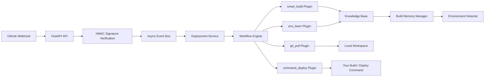

# BuildClaw

[English](./README.md) | [简体中文](./README.zh-CN.md)

> [!IMPORTANT]
> BuildClaw v0.2.0 introduces an **Intelligent Build Orchestration** system inspired by the Hermes-Agent long-memory and self-learning architecture.
> The system can now auto-detect project types (Java/Maven, Java/Gradle, PHP/Composer, Ruby/Bundler, Go/Modules, Node/npm, Python/pip, Rust/Cargo, .NET, and more),
> generate build plans from a persistent knowledge base, learn from build outcomes, and automatically apply workarounds for known issues.

BuildClaw is a FastAPI-based auto-deployment service designed to receive GitHub webhook events, synchronize repository code to a local workspace, and execute project-specific deployment commands in a controlled, observable way — now with **intelligent build orchestration** that adapts to any language ecosystem.

## Table of Contents

- [Why BuildClaw](#why-buildclaw)
- [Intelligent Build System](#intelligent-build-system)
- [Architecture](#architecture)
- [Repository Layout](#repository-layout)
- [Quick Start](#quick-start)
- [Configuration](#configuration)
- [Supported Project Types](#supported-project-types)
- [API Reference](#api-reference)
- [Deployment Assets](#deployment-assets)
- [GitHub Webhook Setup](#github-webhook-setup)
- [Detailed Deployment Guide](#detailed-deployment-guide)
- [Operations and Troubleshooting](#operations-and-troubleshooting)
- [Security Recommendations](#security-recommendations)
- [Roadmap](#roadmap)

## Why BuildClaw

Many deployment tools are either too platform-specific or too opinionated for teams that want to control their own deployment commands. BuildClaw takes a simpler approach:

- keep the webhook intake predictable
- keep repository synchronization explicit
- keep deployment execution configurable
- keep the orchestration layer extensible for future plugins such as Docker, Kubernetes, or VM-based deployment
- **auto-detect project types and generate build plans** — no manual configuration needed for common stacks
- **learn from build failures** — the system gets smarter over time

This makes BuildClaw a good fit when you want a lightweight deployment control plane without immediately committing to a large platform stack.

## Intelligent Build System

BuildClaw v0.2.0 introduces an intelligent build orchestration system inspired by the [Hermes-Agent](https://github.com/rockmelodies/hermes-agent) long-memory and self-learning architecture. The system consists of five core components:

### 1. Environment Detector (`env_detector`)

Scans the workspace for marker files to automatically identify the project type:

| Marker File | Project Type |
|---|---|
| `pom.xml` | Java / Maven |
| `build.gradle` / `build.gradle.kts` | Java / Gradle |
| `composer.json` | PHP / Composer |
| `Gemfile` | Ruby / Bundler |
| `go.mod` | Go / Modules |
| `package.json` + `package-lock.json` | Node.js / npm |
| `package.json` + `yarn.lock` | Node.js / Yarn |
| `requirements.txt` / `setup.py` | Python / pip |
| `pyproject.toml` | Python / Poetry |
| `Cargo.toml` | Rust / Cargo |
| `*.csproj` / `*.fsproj` | .NET |

The detector also identifies frameworks (Spring Boot, Laravel, Rails, Next.js, Django, etc.) and runtime versions from version files (`.java-version`, `.nvmrc`, `.ruby-version`, `.tool-versions`).

### 2. Build Knowledge Base (`knowledge_base`)

A persistent YAML-backed store that maintains:

- **Build Recipes**: Pre-configured and user-customized build strategies per project type, including install/test/build/deploy commands, required tools, environment variables, and known issues
- **Repo Learnings**: Per-repository accumulated knowledge from build outcomes — custom commands, discovered environment variables, failure patterns, and workarounds
- **Build Patterns**: Common failure patterns and their solutions organized by language ecosystem

The knowledge base ships with 11 built-in recipes covering the most common language/tool combinations.

### 3. Build Memory Manager (`build_memory`)

The central orchestrator that coordinates the intelligent build flow:

1. **Pre-deploy**: Detects the environment, recalls relevant knowledge, and generates a `BuildPlan`
2. **Post-deploy**: Records build outcomes (success/failure) for future learning
3. **Plan generation**: Merges detection results, recipes, and repo learnings with priority: `repo_learning > recipe > detection > fallback`

### 4. Smart Build Plugin (`smart_build`)

An intelligent deployment plugin that:

- Auto-detects the project type and selects the appropriate build recipe
- Executes build phases (install → test → build → deploy) step by step
- Applies known workarounds when build failures match known patterns
- Retries failed builds with workarounds up to a configurable limit
- Records all outcomes back to the knowledge base

### 5. Env Learn Plugin (`env_learn`)

A post-deployment learning plugin that:

- Analyzes build errors using language-specific error pattern extractors (Java, PHP, Ruby, Go, JavaScript, Python, Rust)
- Suggests workarounds based on error categories
- Scans the workspace for runtime requirements (Docker, CI/CD, databases, environment variables)
- Records discovered workarounds for future builds

### 6. Build Insights Engine (`build_insights`)

An analytics engine that produces insights from the knowledge base:

- Recipe health scores (success rate, workaround usage, recency)
- Repository-specific build analytics
- Top failure patterns across all repositories
- Coverage gaps (project types without recipes)
- Actionable recommendations

## Architecture


```mermaid
flowchart LR
    GH[GitHub Webhook] --> API[FastAPI API]
    API --> SIG[HMAC Signature Verification]
    SIG --> BUS[Async Event Bus]
    BUS --> DEPLOY[Deployment Service]
    DEPLOY --> WF[Workflow Engine]
    WF --> GIT[git_pull Plugin]
    WF --> SMART[smart_build Plugin]
    WF --> CMD[command_deploy Plugin]
    WF --> LEARN[env_learn Plugin]
    SMART --> KB[Knowledge Base]
    LEARN --> KB
    KB --> MEM[Build Memory Manager]
    MEM --> DET[Environment Detector]
    GIT --> WS[Local Workspace]
    CMD --> TARGET[Your Build / Deploy Command]
```

### Intelligent build flow

1. GitHub sends a `push` webhook request to BuildClaw.
2. BuildClaw validates `X-Hub-Signature-256`.
3. The request is converted into an internal deployment trigger.
4. The deployment service resolves the matching branch policy.
5. The workflow engine runs `git_pull` first.
6. **If `smart_build` is configured**: the environment detector scans the workspace, the knowledge base recalls relevant recipes and repo learnings, and a build plan is generated and executed.
7. **If `env_learn` is configured**: after deployment (success or failure), the plugin analyzes errors, suggests workarounds, and records outcomes for future learning.
8. Logs are written through the application logger for inspection and debugging.

## Repository Layout

```text
.
|-- backend/
|   |-- app/
|   |   |-- core/              # infrastructure primitives
|   |   |   |-- event_bus.py   # async event bus
|   |   |   |-- workflow.py    # workflow engine
|   |   |   |-- process.py     # process execution helpers
|   |   |   |-- plugins.py     # plugin registry
|   |   |   |-- env_detector.py    # environment detection engine
|   |   |   |-- knowledge_base.py  # persistent build knowledge store
|   |   |   |-- build_memory.py    # build memory manager
|   |   |   `-- build_insights.py  # build analytics engine
|   |   |-- plugins/           # deployment step plugins
|   |   |   |-- git_pull.py        # repository synchronization
|   |   |   |-- command_deploy.py  # command-based deployment
|   |   |   |-- smart_build.py     # intelligent auto-build
|   |   |   `-- env_learn.py       # post-deploy learning
|   |   |-- services/          # deployment orchestration
|   |   |-- config.py          # typed config loading
|   |   `-- main.py            # FastAPI application entrypoint
|   |-- config.yaml            # active runtime config
|   |-- config.example.yaml
|   `-- pyproject.toml
|-- README.md
`-- README.zh-CN.md
```

## Quick Start

### Prerequisites

Before you begin, make sure your system has the following software installed:

| Software | Minimum Version | How to Check | How to Install |
|---|---|---|---|
| **Python** | 3.11+ | `python --version` or `python3 --version` | [python.org](https://www.python.org/downloads/) or your OS package manager |
| **Git** | 2.x | `git --version` | [git-scm.com](https://git-scm.com/downloads) or your OS package manager |
| **pip** | latest | `pip --version` or `pip3 --version` | Usually bundled with Python |

> [!NOTE]
> You also need build tools for the languages you want to deploy. For example:
> - **Java**: install `mvn` ([Maven](https://maven.apache.org/download.cgi)) or `gradle` ([Gradle](https://gradle.org/install/))
> - **PHP**: install `php` and `composer` ([getcomposer.org](https://getcomposer.org/download/))
> - **Ruby**: install `ruby` and `bundler` (`gem install bundler`)
> - **Go**: install `go` ([go.dev](https://go.dev/dl/))
> - **Node.js**: install `node` and `npm` ([nodejs.org](https://nodejs.org/))
> - **Python**: install `pip` or `poetry` ([python-poetry.org](https://python-poetry.org/docs/#installation))
> - **Rust**: install `cargo` ([rustup.rs](https://rustup.rs/))
> - **.NET**: install `dotnet` ([dot.net](https://dotnet.microsoft.com/download))
>
> These are **not required** to run BuildClaw itself — only needed on the deployment server if you want BuildClaw to build projects in that language.

### Step 1: Install Python (if not already installed)

**Ubuntu / Debian:**

```bash
sudo apt update
sudo apt install python3 python3-pip python3-venv -y
```

**CentOS / RHEL:**

```bash
sudo yum install python3 python3-pip -y
```

**macOS (using Homebrew):**

```bash
brew install python@3.11
```

**Windows:**

Download and install from [python.org](https://www.python.org/downloads/). Make sure to check **"Add Python to PATH"** during installation.

Verify installation:

```bash
python3 --version   # should show 3.11 or higher
pip3 --version      # should show a version number
```

### Step 2: Install Git (if not already installed)

**Ubuntu / Debian:**

```bash
sudo apt install git -y
```

**CentOS / RHEL:**

```bash
sudo yum install git -y
```

**macOS:**

```bash
brew install git
```

**Windows:**

Download and install from [git-scm.com](https://git-scm.com/downloads/win).

Verify installation:

```bash
git --version   # should show git version 2.x
```

### Step 3: Clone the BuildClaw repository

```bash
git clone https://github.com/rockmelodies/buildclaw.git
cd buildclaw
```

### Step 4: Create a Python virtual environment

A virtual environment keeps BuildClaw's dependencies isolated from your system Python.

**Linux / macOS:**

```bash
cd backend
python3 -m venv .venv
source .venv/bin/activate
```

**Windows (PowerShell):**

```powershell
cd backend
python -m venv .venv
.\.venv\Scripts\Activate.ps1
```

> [!TIP]
> If PowerShell shows an error about execution policy, run this first:
> ```powershell
> Set-ExecutionPolicy -ExecutionPolicy RemoteSigned -Scope CurrentUser
> ```

**Windows (Command Prompt):**

```cmd
cd backend
python -m venv .venv
.\.venv\Scripts\activate.bat
```

You should see `(.venv)` in your terminal prompt after activation.

### Step 5: Install BuildClaw dependencies

**Using the install script (recommended):**

**Linux / macOS:**

```bash
./scripts/install.sh
```

**Windows (PowerShell):**

```powershell
.\scripts\install.ps1
```

**Or install manually:**

```bash
pip install --upgrade pip
pip install -e .
```

> [!NOTE]
> The `-e .` flag installs BuildClaw in "editable" mode, so changes to the source code take effect immediately without reinstalling.

### Step 6: Prepare configuration

Copy the example configuration file and edit it:

```bash
cp config.example.yaml config.yaml
```

Then open `config.yaml` in your favorite text editor. At minimum, you need to change:

1. **`webhook_secret`** — replace `"replace-me"` with a secure random string
2. **`git_url`** — point it to the repository you want to auto-deploy
3. **`knowledge.enabled`** — set to `true` to enable intelligent build orchestration

Here's a minimal working configuration:

```yaml
server:
  address: "0.0.0.0"
  port: 8080

workspace_root: "./workspace"

knowledge:
  enabled: true
  knowledge_root: "./knowledge"
  auto_detect: true
  auto_learn: true
  apply_workarounds: true
  max_retry_with_workaround: 2

repositories:
  - id: "my-project"
    name: "My Project"
    git_url: "https://github.com/your-username/your-repo.git"
    webhook_secret: "your-secret-here"
    auth:
      https_username: "git"
      https_token: ""           # Add your GitHub token here for private repos
      ssh_private_key_base64: ""
    branches:
      - pattern: "main"
        steps:
          - name: "smart-build"
            plugin: "smart_build"
            config:
              phases: ["install", "test", "build"]
              apply_workarounds: true
```

> [!TIP]
> To generate a secure webhook secret, run:
> ```bash
> python3 -c "import secrets; print(secrets.token_urlsafe(48))"
> ```
> Copy the output and paste it as your `webhook_secret`.

### Step 7: Start the service

```bash
uvicorn app.main:app --host 0.0.0.0 --port 8080
```

You should see output like:

```
INFO:     Started server process [12345]
INFO:     Waiting for application startup.
INFO:     Application startup complete.
INFO:     Uvicorn running on http://0.0.0.0:8080 (Press CTRL+C to quit)
```

### Step 8: Verify the service is running

Open a new terminal and run:

```bash
curl http://127.0.0.1:8080/healthz
```

Expected response:

```json
{"status":"ok"}
```

Check readiness (includes knowledge base status):

```bash
curl http://127.0.0.1:8080/readyz
```

Expected response:

```json
{
  "ok": true,
  "checks": {
    "git_available": {"ok": true, "path": "/usr/bin/git"},
    "workspace_root": {"ok": true, "path": "./workspace", "exists": true, "writable": true},
    "repositories_configured": {"ok": true, "count": 1},
    "python_version": {"ok": true, "value": "3.11.0"},
    "knowledge_base": {"ok": true, "enabled": true, "path": "./knowledge", "writable": true},
    "build_tools": {"ok": true, "available": {"java": false, "mvn": false, "go": true, "node": true, "npm": true}}
  }
}
```

### Step 9: Set up the GitHub webhook

Follow the [GitHub Webhook Setup](#github-webhook-setup) section below to connect your GitHub repository.

### Step 10: Test with a push

Push a commit to the `main` branch of your configured repository and watch BuildClaw logs for the deployment process.

---

## Configuration

The backend reads `backend/config.yaml` by default. You can override it with:

```bash
BUILDCLAW_CONFIG=/path/to/config.yaml
```

You can also populate runtime variables from:

- `backend/.env`
- a custom dotenv file referenced by `BUILDCLAW_ENV_FILE`

### Full configuration structure

```yaml
server:
  address: "0.0.0.0"
  port: 8080

workspace_root: "./workspace"

# Intelligent build orchestration configuration
knowledge:
  enabled: true
  knowledge_root: "./knowledge"
  auto_detect: true
  auto_learn: true
  apply_workarounds: true
  max_retry_with_workaround: 2

repositories:
  - id: "my-java-project"
    name: "My Java Project"
    git_url: "https://github.com/example/java-project.git"
    webhook_secret: "replace-me"
    auth:
      https_username: "git"
      https_token: ""
      ssh_private_key_base64: ""
    branches:
      # Smart build with auto-detection
      - pattern: "main"
        steps:
          - name: "smart-build-main"
            plugin: "smart_build"
            config:
              phases: ["install", "test", "build", "deploy"]
              skip_tests: false
              apply_workarounds: true
              max_retry_with_workaround: 2
      # Traditional command-based deployment
      - pattern: "feature/*"
        steps:
          - name: "preview-check"
            plugin: "command_deploy"
            config:
              command: ["go", "test", "./..."]
              working_dir: "backend"
              timeout_sec: 300
```

### Knowledge configuration

| Field | Type | Default | Description |
|---|---|---|---|
| `enabled` | bool | `false` | Enable the intelligent build system |
| `knowledge_root` | string | `"./knowledge"` | Root directory for persistent knowledge storage |
| `auto_detect` | bool | `true` | Auto-detect project types during deployment |
| `auto_learn` | bool | `true` | Learn from build outcomes |
| `apply_workarounds` | bool | `true` | Apply known workarounds on build failure |
| `max_retry_with_workaround` | int | `2` | Maximum retry attempts with workarounds |

### Smart build plugin configuration

| Field | Type | Default | Description |
|---|---|---|---|
| `phases` | list | `["install", "build"]` | Build phases to execute |
| `skip_tests` | bool | `false` | Skip the test phase |
| `apply_workarounds` | bool | `true` | Apply workarounds from knowledge base |
| `max_retry_with_workaround` | int | `2` | Max retries with workarounds |
| `timeout_per_phase` | int | `600` | Timeout in seconds per phase |

### Branch rule behavior

BuildClaw resolves branch rules in this order:

1. exact match, for example `main`
2. longest prefix wildcard, for example `feature/*`
3. global wildcard `*`

### Deployment step behavior

Every deployment currently starts with an implicit `git_pull` step generated by the service layer. The `steps` you configure under each branch are appended after code synchronization succeeds.

## Supported Project Types

BuildClaw ships with built-in recipes for the following project types:

| Project Type | Language | Build Tool | Install | Test | Build |
|---|---|---|---|---|---|
| `java-maven` | Java | Maven | `mvn dependency:resolve` | `mvn test` | `mvn package -DskipTests` |
| `java-gradle` | Java | Gradle | `gradle dependencies` | `gradle test` | `gradle build -x test` |
| `php-composer` | PHP | Composer | `composer install --no-interaction` | `vendor/bin/phpunit` | — |
| `ruby-bundler` | Ruby | Bundler | `bundle install` | `bundle exec rake test` | — |
| `go-modules` | Go | Go Modules | `go mod download` | `go test ./...` | `go build ./...` |
| `node-npm` | Node.js | npm | `npm ci` | `npm test` | `npm run build` |
| `node-yarn` | Node.js | Yarn | `yarn install --frozen-lockfile` | `yarn test` | `yarn build` |
| `python-pip` | Python | pip | `pip install -r requirements.txt` | `pytest` | — |
| `python-poetry` | Python | Poetry | `poetry install` | `poetry run pytest` | `poetry build` |
| `rust-cargo` | Rust | Cargo | `cargo fetch` | `cargo test` | `cargo build --release` |
| `dotnet` | .NET | dotnet CLI | `dotnet restore` | `dotnet test` | `dotnet build --configuration Release` |

You can customize any recipe or add new ones through the knowledge base API.

## API Reference

### Webhook endpoints

| Method | Path | Description |
|---|---|---|
| `POST` | `/webhooks/github/{repo_id}` | Receive GitHub webhook events |

### Health endpoints

| Method | Path | Description |
|---|---|---|
| `GET` | `/healthz` | Liveness check |
| `GET` | `/readyz` | Readiness check (includes knowledge base status) |

### Knowledge base endpoints

| Method | Path | Description |
|---|---|---|
| `GET` | `/api/v1/knowledge/recipes` | List all build recipes |
| `GET` | `/api/v1/knowledge/recipes/{project_type}` | Get a specific recipe |
| `GET` | `/api/v1/knowledge/repos` | List all repo learnings |
| `GET` | `/api/v1/knowledge/repos/{repo_id}` | Get a specific repo learning |

### Build orchestration endpoints

| Method | Path | Description |
|---|---|---|
| `POST` | `/api/v1/detect/{repo_id}` | Detect environment for a repository |
| `POST` | `/api/v1/plan/{repo_id}` | Generate a build plan for a repository |

### Insights endpoints

| Method | Path | Description |
|---|---|---|
| `GET` | `/api/v1/insights` | Get build insights as JSON |
| `GET` | `/api/v1/insights/text` | Get build insights as plain text |

## Deployment Assets

BuildClaw now ships with multiple deployment-oriented assets out of the box:

- `backend/.env.example`: example runtime environment variables
- `backend/scripts/install.sh`: Linux/macOS bootstrap script
- `backend/scripts/install.ps1`: Windows bootstrap script
- `backend/scripts/doctor.py`: environment readiness validator
- `backend/Dockerfile`: container image definition
- `backend/docker-compose.yml`: local or single-host container deployment
- `backend/deploy/systemd/buildclaw.service`: systemd unit template
- `backend/deploy/nginx/buildclaw.conf`: reverse proxy example

Run the doctor manually at any time:

```bash
cd backend
python scripts/doctor.py
```

Example readiness response (with knowledge system enabled):

```json
{
  "ok": true,
  "checks": {
    "git_available": {"ok": true},
    "workspace_root": {"ok": true},
    "repositories_configured": {"ok": true},
    "python_version": {"ok": true},
    "knowledge_base": {
      "ok": true,
      "enabled": true,
      "path": "./knowledge",
      "writable": true,
      "auto_detect": true,
      "auto_learn": true
    },
    "build_tools": {
      "ok": true,
      "available": {
        "java": true,
        "mvn": true,
        "go": true,
        "node": true,
        "npm": true
      }
    }
  }
}
```

## GitHub Webhook Setup

### 1. Choose a webhook secret

Generate a strong secret and place the same value in:

- `backend/config.yaml` -> `repositories[].webhook_secret`
- GitHub repository settings -> Webhooks -> Secret

Example:

```bash
python3 -c "import secrets; print(secrets.token_urlsafe(48))"
```

Copy the output string. Then:

1. Paste it into `config.yaml` as the `webhook_secret` value
2. Save the same value for Step 2 below

### 2. Configure the webhook in GitHub

In your GitHub repository:

1. Open **Settings** (the gear icon on your repo page)
2. Click **Webhooks** in the left sidebar
3. Click **Add webhook**
4. Set **Payload URL** to:

```text
https://your-domain.example.com/webhooks/github/my-project
```

> [!IMPORTANT]
> Replace `your-domain.example.com` with your actual server domain or IP address.
> Replace `my-project` with the `id` you set in `config.yaml`.

5. Set **Content type** to `application/json`
6. Set **Secret** to the same value you put in `config.yaml`
7. Select **Just the push event**
8. Click **Add webhook**

### 3. Validate delivery

After adding the webhook, GitHub will send a `ping` event. Check the **Recent Deliveries** section:

- `ping` event should return `200 OK`
- Future `push` events should return `202 Accepted`

If the ping fails, check:
- Your server is reachable from the internet
- The URL is correct
- The service is running

### 4. Manual local webhook test (for development)

You can manually generate a valid GitHub-style signature:

```bash
python3 - <<'PY'
import hmac
import json
from hashlib import sha256

secret = b"replace-me"  # Use your actual webhook_secret
payload = json.dumps({
    "ref": "refs/heads/main",
    "after": "1234567890abcdef1234567890abcdef12345678"
}).encode()

signature = "sha256=" + hmac.new(secret, payload, sha256).hexdigest()
print("Payload:", payload.decode())
print("Signature:", signature)
PY
```

Then send it with `curl`:

```bash
curl -X POST "http://127.0.0.1:8080/webhooks/github/my-project" \
  -H "Content-Type: application/json" \
  -H "X-GitHub-Event: push" \
  -H "X-Hub-Signature-256: sha256=YOUR_SIGNATURE" \
  -d '{"ref":"refs/heads/main","after":"1234567890abcdef1234567890abcdef12345678"}'
```

## Detailed Deployment Guide

### Deployment model

BuildClaw supports two deployment modes:

1. **Intelligent mode** (`smart_build` plugin): Auto-detects the project type, selects the appropriate build recipe, and executes the build plan. Learns from failures and applies workarounds automatically.

2. **Manual mode** (`command_deploy` plugin): Executes your own deployment command. This gives you full control and is suitable for custom workflows.

### Option A: Quick local deployment (for testing)

This is the fastest way to get BuildClaw running on your own machine for testing:

```bash
# 1. Clone and enter the project
git clone https://github.com/rockmelodies/buildclaw.git
cd buildclaw/backend

# 2. Create virtual environment
python3 -m venv .venv
source .venv/bin/activate   # Linux/macOS
# .\.venv\Scripts\Activate.ps1  # Windows PowerShell

# 3. Install dependencies
pip install --upgrade pip
pip install -e .

# 4. Configure
cp config.example.yaml config.yaml
# Edit config.yaml with your settings

# 5. Run
uvicorn app.main:app --host 0.0.0.0 --port 8080
```

### Option B: Container deployment with Docker

If you prefer to run the backend in Docker:

```bash
cd backend
cp .env.example .env
cp config.example.yaml config.yaml
# Edit config.yaml with your settings
docker compose up --build -d
```

Then verify:

```bash
curl http://127.0.0.1:8080/readyz
docker compose ps
docker compose logs -f
```

To stop:

```bash
docker compose down
```

### Option C: Production deployment on Linux

For a production-like Linux deployment, use:

- a dedicated Linux user such as `buildclaw`
- a Python virtual environment
- a reverse proxy such as Nginx or Caddy
- a systemd service for process supervision
- a persistent workspace directory
- a persistent knowledge base directory

#### Step 1. Create a dedicated user

```bash
sudo useradd --create-home --shell /bin/bash buildclaw
sudo su - buildclaw
```

#### Step 2. Clone the project on the server

```bash
git clone https://github.com/rockmelodies/buildclaw.git
cd buildclaw/backend
python3 -m venv .venv
source .venv/bin/activate
python -m pip install --upgrade pip
python -m pip install -e .
```

#### Step 3. Prepare runtime configuration

Edit `backend/config.yaml` carefully:

- set the right repository `id`
- point `git_url` to the application repository you want to deploy
- set a secure `webhook_secret`
- configure either HTTPS token or SSH private key
- set `workspace_root` to a writable persistent path
- enable the knowledge system and set `knowledge_root`
- configure branch rules with `smart_build` or `command_deploy`

Example with smart_build:

```yaml
knowledge:
  enabled: true
  knowledge_root: "./knowledge"
  auto_detect: true
  auto_learn: true
  apply_workarounds: true

repositories:
  - id: "my-project"
    branches:
      - pattern: "main"
        steps:
          - name: "smart-build"
            plugin: "smart_build"
            config:
              phases: ["install", "test", "build", "deploy"]
              apply_workarounds: true
```

Example with command_deploy:

```yaml
steps:
  - name: "deploy-main"
    plugin: "command_deploy"
    config:
      command: ["bash", "scripts/deploy.sh"]
      working_dir: "."
      timeout_sec: 900
```

#### Step 4. Create the deployment script (command_deploy mode only)

Example `scripts/deploy.sh`:

```bash
#!/usr/bin/env bash
set -euo pipefail

echo "Installing dependencies"
python -m pip install -r requirements.txt

echo "Running migrations"
python manage.py migrate

echo "Restarting application"
sudo systemctl restart my-app.service
```

> [!TIP]
> Keep deployment scripts idempotent whenever possible. If the webhook is retried or a deployment is triggered twice, your script should safely converge to the desired state.

#### Step 5. Create a systemd service

Example `/etc/systemd/system/buildclaw.service`:

```ini
[Unit]
Description=BuildClaw FastAPI backend
After=network.target

[Service]
Type=simple
User=buildclaw
WorkingDirectory=/home/buildclaw/buildclaw/backend
Environment=BUILDCLAW_CONFIG=/home/buildclaw/buildclaw/backend/config.yaml
ExecStart=/home/buildclaw/buildclaw/backend/.venv/bin/uvicorn app.main:app --host 0.0.0.0 --port 8080
Restart=always
RestartSec=3

[Install]
WantedBy=multi-user.target
```

Enable and start it:

```bash
sudo systemctl daemon-reload
sudo systemctl enable buildclaw
sudo systemctl start buildclaw
sudo systemctl status buildclaw
```

#### Step 6. Put a reverse proxy in front

Example Nginx site:

```nginx
server {
    listen 80;
    server_name your-domain.example.com;

    location / {
        proxy_pass http://127.0.0.1:8080;
        proxy_set_header Host $host;
        proxy_set_header X-Real-IP $remote_addr;
        proxy_set_header X-Forwarded-For $proxy_add_x_forwarded_for;
        proxy_set_header X-Forwarded-Proto $scheme;
    }
}
```

#### Step 7. Expose only what you need

- allow inbound traffic to the webhook endpoint
- restrict server SSH access
- avoid exposing internal-only service ports directly when a reverse proxy is available

#### Step 8. Observe logs

If running under systemd:

```bash
sudo journalctl -u buildclaw -f
```

#### Step 9. Validate a full end-to-end deployment

After the service is reachable and the webhook is configured:

1. push a commit to a configured branch
2. verify GitHub delivery status
3. watch BuildClaw logs
4. verify that the repository was checked out under `workspace_root`
5. verify that the build plan was generated and executed (check `/api/v1/insights` for analytics)

## Operations and Troubleshooting

### Health check returns 200 but deployments do not run

Check:

- webhook secret matches on both sides
- the request path uses the correct repository `id`
- the pushed branch matches a configured branch rule
- `git` is installed and executable
- the service user can write to `workspace_root`

### Smart build does not detect my project type

Check:

- the workspace contains the expected marker files (e.g., `pom.xml`, `go.mod`, `package.json`)
- the `knowledge.enabled` flag is set to `true` in config
- the `knowledge.auto_detect` flag is set to `true`
- use `POST /api/v1/detect/{repo_id}` to manually trigger detection and see results

### Build fails but no workaround is applied

Check:

- `apply_workarounds` is set to `true` in both knowledge config and smart_build config
- the error pattern matches a known issue in the knowledge base
- use `GET /api/v1/knowledge/recipes/{project_type}` to check if known issues are recorded
- use `GET /api/v1/insights` to see failure analytics

### Signature validation fails

Check:

- `X-Hub-Signature-256` is present
- the payload was not altered by an upstream proxy
- the GitHub webhook secret exactly matches `config.yaml`

### Git clone or fetch fails

Check:

- repository URL is correct
- network access to GitHub is available
- HTTPS token or SSH key is valid
- the service user has permission to use the configured SSH client

### Deployment command fails

Check:

- the configured `working_dir` exists after repository sync
- the command is available in the service user's environment
- the command does not require interactive input
- the timeout is large enough for real deployment duration

### Where are synchronized repositories stored

By default:

```text
backend/workspace/{repo_id}/{sanitized_branch_name}
```

unless a branch rule explicitly defines `worktree`.

### Where is the knowledge base stored

By default:

```text
backend/knowledge/
  recipes/       # Build recipes per project type
  learnings/     # Per-repository build learnings
  patterns/      # Common failure patterns
```

## Security Recommendations

> [!WARNING]
> `command_deploy` executes whatever command you configure. Treat the config file and deployment scripts as privileged assets.

- use a dedicated low-privilege service account
- store webhook secrets outside version control in real deployments
- prefer SSH keys or fine-grained access tokens with minimal scope
- keep deployment scripts non-interactive
- review any command change with the same rigor as production code
- protect your reverse proxy with HTTPS
- restrict outbound and inbound network access where possible
- the knowledge base directory should be writable only by the service user

## Roadmap

- persistent deployment records
- rollback support
- Docker deployment plugin
- Kubernetes deployment plugin
- richer workflow and approval semantics
- streaming deployment logs to clients
- externalized event transport
- multi-project workspace detection (monorepo support)
- custom recipe editor UI
- knowledge base import/export

---

If you want the Chinese documentation, see [README.zh-CN.md](./README.zh-CN.md).
