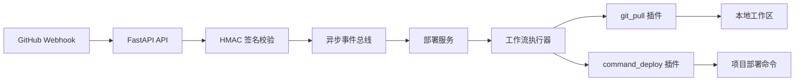

# BuildClaw

[English](./README.md) | [简体中文](./README.zh-CN.md)

> [!IMPORTANT]
> BuildClaw 目前仍处于早期原型阶段。
> 当前已经打通的有效链路是：
> `GitHub Webhook -> 签名校验 -> 异步事件分发 -> Git 拉取 -> 部署命令执行`

BuildClaw 是一个基于 FastAPI 的自动化部署后端，目标是接收 GitHub Webhook、将目标仓库同步到本地工作目录，并在可控、可观测的前提下执行项目自己的部署命令。

当前代码重点放在一个可扩展、职责清晰的后端基础上：

- 使用 FastAPI 提供 Webhook 接入能力
- 使用 HMAC-SHA256 校验 GitHub 请求签名
- 使用进程内异步事件总线解耦请求处理与部署执行
- 提供 `git_pull` 插件负责代码同步
- 提供 `command_deploy` 插件负责命令式部署
- 支持按分支规则进行精确匹配和通配匹配

## 目录

- [项目目标](#项目目标)
- [当前能力边界](#当前能力边界)
- [架构说明](#架构说明)
- [仓库结构](#仓库结构)
- [快速开始](#快速开始)
- [配置说明](#配置说明)
- [GitHub Webhook 配置](#github-webhook-配置)
- [详细部署指南](#详细部署指南)
- [运维与排障](#运维与排障)
- [安全建议](#安全建议)
- [后续规划](#后续规划)

## 项目目标

很多部署平台要么绑定特定技术栈，要么平台化程度太高，接入成本不低。BuildClaw 的思路更直接：

- Webhook 接入尽量简单
- 代码同步过程尽量显式
- 部署执行逻辑尽量由项目自己控制
- 插件层预留扩展空间，方便未来继续接 Docker、Kubernetes、虚拟机等部署方式

因此它比较适合下面这类场景：

- 团队希望先快速做一个可控的自动部署入口
- 部署逻辑已经存在于脚本、命令或现有工具中
- 希望后续逐步演进，而不是一次性上完整平台

## 当前能力边界

### 已实现

- `POST /webhooks/github/{repo_id}`
- GitHub `push` 事件处理
- GitHub `ping` 事件响应
- Webhook HMAC-SHA256 验签
- 分支规则匹配
- 本地工作区代码拉取与指定 commit 切换
- 命令式部署插件执行
- `/healthz` 健康检查接口
- 后端日志输出

### 尚未实现

- 持久化部署记录
- 自动回滚流程
- 人工审批流
- Docker / Kubernetes 专用插件
- 前端实时日志推送
- Redis Streams / Kafka 之类的外部事件总线

## 架构说明



### 执行流程

1. GitHub 向 BuildClaw 发送 `push` Webhook。
2. BuildClaw 校验 `X-Hub-Signature-256`。
3. 请求被转换成内部部署触发事件。
4. 部署服务根据 `repo_id` 和分支匹配规则。
5. 工作流先执行 `git_pull`。
6. 代码同步完成后，再执行你配置的 `command_deploy`。
7. 整个过程通过应用日志输出，便于排查问题。

## 仓库结构

```text
.
|-- backend/
|   |-- app/
|   |   |-- core/          # 基础设施层：事件总线、工作流、进程执行辅助
|   |   |-- plugins/       # 部署插件实现
|   |   |-- services/      # 部署编排与仓库规则解析
|   |   |-- config.py      # 配置读取与校验
|   |   `-- main.py        # FastAPI 入口
|   |-- config.yaml        # 当前运行配置
|   |-- config.example.yaml
|   `-- pyproject.toml
|-- README.md
`-- README.zh-CN.md
```

## 快速开始

### 环境要求

- Python `3.11+`
- 系统已安装 `git`，并且在 `PATH` 中可用
- 部署服务器可以访问 Git 仓库
- GitHub 可以访问你的 Webhook 地址
- 如果使用 SSH 拉取代码，需要系统可用 OpenSSH 客户端

### 1. 克隆仓库

```bash
git clone https://github.com/rockmelodies/buildclaw.git
cd buildclaw
```

### 2. 安装后端依赖

```bash
cd backend
python -m pip install -e .
```

### 3. 准备配置文件

先复制示例配置：

```bash
cp config.example.yaml config.yaml
```

然后编辑 `config.yaml`，至少完成这些内容：

- 设置 `webhook_secret`
- 配置仓库认证方式
- 配置分支规则
- 把示例部署命令替换成你自己的真实部署命令

### 4. 启动服务

```bash
uvicorn app.main:app --host 0.0.0.0 --port 8080
```

### 5. 验证服务是否正常

```bash
curl http://127.0.0.1:8080/healthz
```

预期返回：

```json
{"status":"ok"}
```

## 配置说明

默认读取：

```text
backend/config.yaml
```

也可以通过环境变量覆盖：

```bash
BUILDCLAW_CONFIG=/path/to/config.yaml
```

### 配置结构示例

```yaml
server:
  address: "0.0.0.0"
  port: 8080

workspace_root: "./workspace"

repositories:
  - id: "buildclaw"
    name: "buildclaw"
    git_url: "https://github.com/rockmelodies/buildclaw.git"
    webhook_secret: "replace-me"
    auth:
      https_username: "git"
      https_token: ""
      ssh_private_key_base64: ""
    branches:
      - pattern: "main"
        steps:
          - name: "deploy-main"
            plugin: "command_deploy"
            config:
              command: ["go", "test", "./..."]
              working_dir: "backend"
              timeout_sec: 300
      - pattern: "feature/*"
        steps:
          - name: "preview-check"
            plugin: "command_deploy"
            config:
              command: ["go", "test", "./..."]
              working_dir: "backend"
              timeout_sec: 300
```

### 分支匹配规则

BuildClaw 按以下优先级匹配：

1. 精确匹配，例如 `main`
2. 最长前缀通配匹配，例如 `feature/*`
3. 全局匹配 `*`

### 部署步骤说明

当前每次部署都会自动先插入一个隐式的 `git_pull` 步骤，然后再执行你在分支规则中配置的步骤。

也就是说，`steps` 中配置的是“代码同步成功之后”要执行的部署动作。

## GitHub Webhook 配置

### 1. 生成 Webhook Secret

同一个 secret 需要同时配置在：

- `backend/config.yaml` 中对应仓库的 `webhook_secret`
- GitHub 仓库设置中的 Webhook Secret

可以这样生成：

```bash
python - <<'PY'
import secrets
print(secrets.token_urlsafe(48))
PY
```

### 2. 在 GitHub 中添加 Webhook

进入你的 GitHub 仓库：

1. 打开 `Settings`
2. 打开 `Webhooks`
3. 点击 `Add webhook`
4. `Payload URL` 填写：

```text
https://your-domain.example.com/webhooks/github/buildclaw
```

5. `Content type` 选择 `application/json`
6. 填写 secret
7. 事件选择 `Just the push event`
8. 保存

### 3. 检查返回结果

预期：

- `ping` 事件返回 `200 OK`
- 合法的 `push` 事件返回 `202 Accepted`

### 4. 本地手动模拟 Webhook

先生成 GitHub 风格签名：

```bash
python - <<'PY'
import hmac
import json
from hashlib import sha256

secret = b"replace-me"
payload = json.dumps({
    "ref": "refs/heads/main",
    "after": "1234567890abcdef1234567890abcdef12345678"
}).encode()

signature = "sha256=" + hmac.new(secret, payload, sha256).hexdigest()
print(payload.decode())
print(signature)
PY
```

然后用 `curl` 发送请求：

```bash
curl -X POST "http://127.0.0.1:8080/webhooks/github/buildclaw" \
  -H "Content-Type: application/json" \
  -H "X-GitHub-Event: push" \
  -H "X-Hub-Signature-256: sha256=YOUR_SIGNATURE" \
  -d '{"ref":"refs/heads/main","after":"1234567890abcdef1234567890abcdef12345678"}'
```

## 详细部署指南

### 当前部署模型

当前版本还没有专门的 Docker / Kubernetes 插件，而是通过 `command_deploy` 执行你指定的部署命令。

这种方式的优点是接入简单、适配广：

- 可以跑测试
- 可以打包构建
- 可以执行 shell 脚本
- 可以调用 Ansible / Fabric / Makefile / 自研发布工具

### 推荐的生产环境部署方式

建议的 Linux 生产部署组合：

- 单独的系统用户，例如 `buildclaw`
- Python 虚拟环境
- Nginx 或 Caddy 反向代理
- systemd 做进程托管
- 持久化工作区目录

### 第 1 步：创建独立运行用户

```bash
sudo useradd --create-home --shell /bin/bash buildclaw
sudo su - buildclaw
```

### 第 2 步：在服务器上部署 BuildClaw

```bash
git clone https://github.com/rockmelodies/buildclaw.git
cd buildclaw/backend
python3 -m venv .venv
source .venv/bin/activate
python -m pip install --upgrade pip
python -m pip install -e .
```

### 第 3 步：准备运行配置

认真编辑 `backend/config.yaml`，重点确认：

- `id` 是否和 Webhook URL 中的 `repo_id` 一致
- `git_url` 是否指向真正要部署的应用仓库
- `webhook_secret` 是否安全且和 GitHub 一致
- 是否正确配置 HTTPS token 或 SSH 私钥
- `workspace_root` 是否是可写、可持久化路径
- 是否把示例命令替换成真实部署命令

例如你可以这样写：

```yaml
steps:
  - name: "deploy-main"
    plugin: "command_deploy"
    config:
      command: ["bash", "scripts/deploy.sh"]
      working_dir: "."
      timeout_sec: 900
```

### 第 4 步：编写部署脚本

示例 `scripts/deploy.sh`：

```bash
#!/usr/bin/env bash
set -euo pipefail

echo "Installing dependencies"
python -m pip install -r requirements.txt

echo "Running migrations"
python manage.py migrate

echo "Restarting application"
sudo systemctl restart my-app.service
```

> [!TIP]
> 强烈建议把部署脚本写成幂等式。这样即使 GitHub 重试 webhook，或者同一个版本被重复触发，也不会把目标环境弄乱。

### 第 5 步：配置 systemd

示例 `/etc/systemd/system/buildclaw.service`：

```ini
[Unit]
Description=BuildClaw FastAPI backend
After=network.target

[Service]
Type=simple
User=buildclaw
WorkingDirectory=/home/buildclaw/buildclaw/backend
Environment=BUILDCLAW_CONFIG=/home/buildclaw/buildclaw/backend/config.yaml
ExecStart=/home/buildclaw/buildclaw/backend/.venv/bin/uvicorn app.main:app --host 0.0.0.0 --port 8080
Restart=always
RestartSec=3

[Install]
WantedBy=multi-user.target
```

启用并启动：

```bash
sudo systemctl daemon-reload
sudo systemctl enable buildclaw
sudo systemctl start buildclaw
sudo systemctl status buildclaw
```

### 第 6 步：接入反向代理

示例 Nginx 配置：

```nginx
server {
    listen 80;
    server_name your-domain.example.com;

    location / {
        proxy_pass http://127.0.0.1:8080;
        proxy_set_header Host $host;
        proxy_set_header X-Real-IP $remote_addr;
        proxy_set_header X-Forwarded-For $proxy_add_x_forwarded_for;
        proxy_set_header X-Forwarded-Proto $scheme;
    }
}
```

### 第 7 步：控制暴露面

- 只开放必要端口
- 优先通过反向代理暴露服务
- 限制 SSH 来源
- 不要把内部端口直接暴露到公网

### 第 8 步：观察运行日志

如果使用 systemd：

```bash
sudo journalctl -u buildclaw -f
```

### 第 9 步：验证完整部署流程

服务启动并配置完成后：

1. 向目标分支推送一个 commit
2. 查看 GitHub Webhook Delivery 状态
3. 查看 BuildClaw 日志
4. 确认 `workspace_root` 下确实出现了同步目录
5. 确认部署命令执行成功

## 运维与排障

### 健康检查正常，但没有触发部署

请检查：

- Webhook secret 是否一致
- 请求路径中的 `repo_id` 是否正确
- 推送的分支是否命中配置规则
- 系统里是否能执行 `git`
- 服务用户是否能写 `workspace_root`

### 签名校验失败

请检查：

- 请求头里是否有 `X-Hub-Signature-256`
- 上游代理是否篡改了请求体
- GitHub 中的 secret 和 `config.yaml` 是否完全一致

### Git 拉取失败

请检查：

- `git_url` 是否正确
- 服务器是否能访问 GitHub
- HTTPS token 或 SSH 私钥是否有效
- 服务用户是否有权限使用 SSH 客户端

### 部署命令失败

请检查：

- `working_dir` 在代码拉取后是否真实存在
- 命令本身是否可执行
- 命令是否依赖交互式输入
- `timeout_sec` 是否足够大

### 本地工作区在哪里

默认位置：

```text
backend/workspace/{repo_id}/{sanitized_branch_name}
```

如果某个分支规则单独配置了 `worktree`，则以该配置为准。

## 安全建议

> [!WARNING]
> `command_deploy` 会执行你配置的命令，因此配置文件和部署脚本本身就属于高权限资产。

- 使用最小权限运行用户
- 生产环境不要把真实 secret 提交进版本库
- 优先使用最小权限 SSH key 或细粒度 token
- 部署脚本尽量避免交互输入
- 对部署命令变更做和生产代码同级别审查
- 通过 HTTPS 暴露 Webhook 服务
- 尽量限制入站和出站网络权限

## 后续规划

- 持久化部署记录
- 回滚支持
- Docker 插件
- Kubernetes 插件
- 更丰富的工作流与审批能力
- 部署日志实时推送
- 接入外部消息系统

---

如需英文文档，请查看 [README.md](./README.md)。
