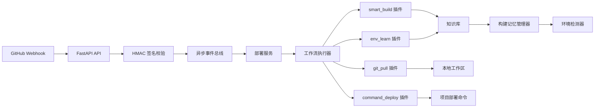

# BuildClaw

[English](./README.md) | [简体中文](./README.zh-CN.md)

> [!IMPORTANT]
> BuildClaw v0.2.0 引入了**智能构建编排**系统，灵感来自 Hermes-Agent 长记忆与自学习架构。
> 系统现在可以自动检测项目类型（Java/Maven、Java/Gradle、PHP/Composer、Ruby/Bundler、Go/Modules、Node/npm、Python/pip、Rust/Cargo、.NET 等），
> 从持久化知识库生成构建计划，从构建结果中学习，并自动应用已知问题的变通方案。

BuildClaw 是一个基于 FastAPI 的自动化部署后端，目标是接收 GitHub Webhook、将目标仓库同步到本地工作目录，并在可控、可观测的前提下执行项目自己的部署命令 —— 现在还支持**智能构建编排**，可自动适配任何语言生态。

## 目录

- [项目目标](#项目目标)
- [智能构建系统](#智能构建系统)
- [架构说明](#架构说明)
- [仓库结构](#仓库结构)
- [快速开始](#快速开始)
- [配置说明](#配置说明)
- [支持的项目类型](#支持的项目类型)
- [API 参考](#api-参考)
- [部署资产](#部署资产)
- [GitHub Webhook 配置](#github-webhook-配置)
- [详细部署指南](#详细部署指南)
- [运维与排障](#运维与排障)
- [安全建议](#安全建议)
- [后续规划](#后续规划)

## 项目目标

很多部署平台要么绑定特定技术栈，要么平台化程度太高，接入成本不低。BuildClaw 的思路更直接：

- Webhook 接入尽量简单
- 代码同步过程尽量显式
- 部署执行逻辑尽量由项目自己控制
- 插件层预留扩展空间，方便未来继续接 Docker、Kubernetes、虚拟机等部署方式
- **自动检测项目类型并生成构建计划** —— 常见技术栈无需手动配置
- **从构建失败中学习** —— 系统会越来越聪明

## 智能构建系统

BuildClaw v0.2.0 引入了智能构建编排系统，灵感来自 [Hermes-Agent](https://github.com/rockmelodies/hermes-agent) 的长记忆与自学习架构。系统由五个核心组件构成：

### 1. 环境检测器（`env_detector`）

扫描工作区中的标记文件，自动识别项目类型：

| 标记文件 | 项目类型 |
|---|---|
| `pom.xml` | Java / Maven |
| `build.gradle` / `build.gradle.kts` | Java / Gradle |
| `composer.json` | PHP / Composer |
| `Gemfile` | Ruby / Bundler |
| `go.mod` | Go / Modules |
| `package.json` + `package-lock.json` | Node.js / npm |
| `package.json` + `yarn.lock` | Node.js / Yarn |
| `requirements.txt` / `setup.py` | Python / pip |
| `pyproject.toml` | Python / Poetry |
| `Cargo.toml` | Rust / Cargo |
| `*.csproj` / `*.fsproj` | .NET |

检测器还能识别框架（Spring Boot、Laravel、Rails、Next.js、Django 等）和运行时版本（`.java-version`、`.nvmrc`、`.ruby-version`、`.tool-versions`）。

### 2. 构建知识库（`knowledge_base`）

基于 YAML 的持久化存储，维护：

- **构建配方（Build Recipes）**：按项目类型预配置和用户自定义的构建策略，包括安装/测试/构建/部署命令、所需工具、环境变量和已知问题
- **仓库学习（Repo Learnings）**：每个仓库从构建结果中积累的知识 —— 自定义命令、发现的环境变量、失败模式和变通方案
- **构建模式（Build Patterns）**：按语言生态组织的常见失败模式及其解决方案

知识库内置 11 个配方，覆盖最常见的语言/工具组合。

### 3. 构建记忆管理器（`build_memory`）

协调智能构建流程的核心编排器：

1. **部署前**：检测环境、回忆相关知识、生成 `BuildPlan`
2. **部署后**：记录构建结果（成功/失败）用于未来学习
3. **计划生成**：合并检测结果、配方和仓库学习，优先级为：`仓库学习 > 配方 > 检测 > 兜底`

### 4. 智能构建插件（`smart_build`）

智能部署插件，功能包括：

- 自动检测项目类型并选择合适的构建配方
- 按阶段执行构建（install → test → build → deploy）
- 构建失败时应用已知变通方案
- 使用变通方案重试失败的构建，最多可配置重试次数
- 将所有结果记录回知识库

### 5. 环境学习插件（`env_learn`）

部署后学习插件，功能包括：

- 使用语言特定的错误模式提取器分析构建错误（Java、PHP、Ruby、Go、JavaScript、Python、Rust）
- 根据错误类别建议变通方案
- 扫描工作区发现运行时需求（Docker、CI/CD、数据库、环境变量）
- 记录发现的变通方案供未来构建使用

### 6. 构建洞察引擎（`build_insights`）

从知识库中生成洞察的分析引擎：

- 配方健康评分（成功率、变通方案使用率、时效性）
- 仓库特定的构建分析
- 所有仓库的 Top 失败模式
- 覆盖缺口（没有配方的项目类型）
- 可操作的建议

## 架构说明


```mermaid
flowchart LR
    GH[GitHub Webhook] --> API[FastAPI API]
    API --> SIG[HMAC 签名校验]
    SIG --> BUS[异步事件总线]
    BUS --> DEPLOY[部署服务]
    DEPLOY --> WF[工作流执行器]
    WF --> GIT[git_pull 插件]
    WF --> SMART[smart_build 插件]
    WF --> CMD[command_deploy 插件]
    WF --> LEARN[env_learn 插件]
    SMART --> KB[知识库]
    LEARN --> KB
    KB --> MEM[构建记忆管理器]
    MEM --> DET[环境检测器]
    GIT --> WS[本地工作区]
    CMD --> TARGET[项目部署命令]
```

### 智能构建流程

1. GitHub 向 BuildClaw 发送 `push` Webhook。
2. BuildClaw 校验 `X-Hub-Signature-256`。
3. 请求被转换成内部部署触发事件。
4. 部署服务根据 `repo_id` 和分支匹配规则。
5. 工作流先执行 `git_pull`。
6. **如果配置了 `smart_build`**：环境检测器扫描工作区，知识库回忆相关配方和仓库学习，生成并执行构建计划。
7. **如果配置了 `env_learn`**：部署后（无论成功或失败），插件分析错误、建议变通方案，并记录结果用于未来学习。
8. 整个过程通过应用日志输出，便于排查问题。

## 仓库结构

```text
.
|-- backend/
|   |-- app/
|   |   |-- core/                  # 基础设施层
|   |   |   |-- event_bus.py       # 异步事件总线
|   |   |   |-- workflow.py        # 工作流执行器
|   |   |   |-- process.py         # 进程执行辅助
|   |   |   |-- plugins.py         # 插件注册
|   |   |   |-- env_detector.py    # 环境检测引擎
|   |   |   |-- knowledge_base.py  # 持久化构建知识存储
|   |   |   |-- build_memory.py    # 构建记忆管理器
|   |   |   `-- build_insights.py  # 构建分析引擎
|   |   |-- plugins/               # 部署插件实现
|   |   |   |-- git_pull.py        # 代码同步
|   |   |   |-- command_deploy.py  # 命令式部署
|   |   |   |-- smart_build.py     # 智能自动构建
|   |   |   `-- env_learn.py       # 部署后学习
|   |   |-- services/              # 部署编排
|   |   |-- config.py              # 配置读取与校验
|   |   `-- main.py                # FastAPI 入口
|   |-- config.yaml                # 当前运行配置
|   |-- config.example.yaml
|   `-- pyproject.toml
|-- README.md
`-- README.zh-CN.md
```

## 快速开始

### 环境要求

在开始之前，请确保你的系统已安装以下软件：

| 软件 | 最低版本 | 检查命令 | 安装方法 |
|---|---|---|---|
| **Python** | 3.11+ | `python --version` 或 `python3 --version` | [python.org](https://www.python.org/downloads/) 或系统包管理器 |
| **Git** | 2.x | `git --version` | [git-scm.com](https://git-scm.com/downloads) 或系统包管理器 |
| **pip** | 最新版 | `pip --version` 或 `pip3 --version` | 通常随 Python 一起安装 |

> [!NOTE]
> 你还需要安装目标语言的构建工具才能部署对应项目。例如：
> - **Java**：安装 `mvn`（[Maven](https://maven.apache.org/download.cgi)）或 `gradle`（[Gradle](https://gradle.org/install/)）
> - **PHP**：安装 `php` 和 `composer`（[getcomposer.org](https://getcomposer.org/download/)）
> - **Ruby**：安装 `ruby` 和 `bundler`（`gem install bundler`）
> - **Go**：安装 `go`（[go.dev](https://go.dev/dl/)）
> - **Node.js**：安装 `node` 和 `npm`（[nodejs.org](https://nodejs.org/)）
> - **Python**：安装 `pip` 或 `poetry`（[python-poetry.org](https://python-poetry.org/docs/#installation)）
> - **Rust**：安装 `cargo`（[rustup.rs](https://rustup.rs/)）
> - **.NET**：安装 `dotnet`（[dot.net](https://dotnet.microsoft.com/download)）
>
> 这些工具**不是**运行 BuildClaw 本身所必需的 —— 只有在部署服务器上构建对应语言项目时才需要。

### 第 1 步：安装 Python（如果尚未安装）

**Ubuntu / Debian：**

```bash
sudo apt update
sudo apt install python3 python3-pip python3-venv -y
```

**CentOS / RHEL：**

```bash
sudo yum install python3 python3-pip -y
```

**macOS（使用 Homebrew）：**

```bash
brew install python@3.11
```

**Windows：**

从 [python.org](https://www.python.org/downloads/) 下载安装。安装时**务必勾选 "Add Python to PATH"**。

验证安装：

```bash
python3 --version   # 应显示 3.11 或更高版本
pip3 --version      # 应显示版本号
```

### 第 2 步：安装 Git（如果尚未安装）

**Ubuntu / Debian：**

```bash
sudo apt install git -y
```

**CentOS / RHEL：**

```bash
sudo yum install git -y
```

**macOS：**

```bash
brew install git
```

**Windows：**

从 [git-scm.com](https://git-scm.com/downloads/win) 下载安装。

验证安装：

```bash
git --version   # 应显示 git version 2.x
```

### 第 3 步：克隆 BuildClaw 仓库

```bash
git clone https://github.com/rockmelodies/buildclaw.git
cd buildclaw
```

### 第 4 步：创建 Python 虚拟环境

虚拟环境可以将 BuildClaw 的依赖与系统 Python 隔离。

**Linux / macOS：**

```bash
cd backend
python3 -m venv .venv
source .venv/bin/activate
```

**Windows（PowerShell）：**

```powershell
cd backend
python -m venv .venv
.\.venv\Scripts\Activate.ps1
```

> [!TIP]
> 如果 PowerShell 提示执行策略错误，先运行：
> ```powershell
> Set-ExecutionPolicy -ExecutionPolicy RemoteSigned -Scope CurrentUser
> ```

**Windows（命令提示符 CMD）：**

```cmd
cd backend
python -m venv .venv
.\.venv\Scripts\activate.bat
```

激活后，终端提示符前应出现 `(.venv)` 标识。

### 第 5 步：安装 BuildClaw 依赖

**使用安装脚本（推荐）：**

**Linux / macOS：**

```bash
./scripts/install.sh
```

**Windows（PowerShell）：**

```powershell
.\scripts\install.ps1
```

**或手动安装：**

```bash
pip install --upgrade pip
pip install -e .
```

> [!NOTE]
> `-e .` 参数以"可编辑"模式安装 BuildClaw，这样修改源代码后无需重新安装即可生效。

### 第 6 步：准备配置文件

复制示例配置文件并编辑：

```bash
cp config.example.yaml config.yaml
```

然后用你喜欢的文本编辑器打开 `config.yaml`，至少需要修改以下内容：

1. **`webhook_secret`** — 将 `"replace-me"` 替换为一个安全的随机字符串
2. **`git_url`** — 指向你要自动部署的仓库地址
3. **`knowledge.enabled`** — 设为 `true` 启用智能构建编排

以下是一个最小可用的配置示例：

```yaml
server:
  address: "0.0.0.0"
  port: 8080

workspace_root: "./workspace"

knowledge:
  enabled: true
  knowledge_root: "./knowledge"
  auto_detect: true
  auto_learn: true
  apply_workarounds: true
  max_retry_with_workaround: 2

repositories:
  - id: "my-project"
    name: "My Project"
    git_url: "https://github.com/your-username/your-repo.git"
    webhook_secret: "your-secret-here"
    auth:
      https_username: "git"
      https_token: ""           # 私有仓库需要填写 GitHub Token
      ssh_private_key_base64: ""
    branches:
      - pattern: "main"
        steps:
          - name: "smart-build"
            plugin: "smart_build"
            config:
              phases: ["install", "test", "build"]
              apply_workarounds: true
```

> [!TIP]
> 生成安全的 webhook secret：
> ```bash
> python3 -c "import secrets; print(secrets.token_urlsafe(48))"
> ```
> 复制输出结果，粘贴为 `webhook_secret` 的值。

### 第 7 步：启动服务

```bash
uvicorn app.main:app --host 0.0.0.0 --port 8080
```

你应该看到类似输出：

```
INFO:     Started server process [12345]
INFO:     Waiting for application startup.
INFO:     Application startup complete.
INFO:     Uvicorn running on http://0.0.0.0:8080 (Press CTRL+C to quit)
```

### 第 8 步：验证服务是否正常运行

打开一个新终端，运行：

```bash
curl http://127.0.0.1:8080/healthz
```

预期返回：

```json
{"status":"ok"}
```

检查就绪状态（包含知识库状态）：

```bash
curl http://127.0.0.1:8080/readyz
```

预期返回：

```json
{
  "ok": true,
  "checks": {
    "git_available": {"ok": true, "path": "/usr/bin/git"},
    "workspace_root": {"ok": true, "path": "./workspace", "exists": true, "writable": true},
    "repositories_configured": {"ok": true, "count": 1},
    "python_version": {"ok": true, "value": "3.11.0"},
    "knowledge_base": {"ok": true, "enabled": true, "path": "./knowledge", "writable": true},
    "build_tools": {"ok": true, "available": {"java": false, "mvn": false, "go": true, "node": true, "npm": true}}
  }
}
```

### 第 9 步：配置 GitHub Webhook

按照下方 [GitHub Webhook 配置](#github-webhook-配置) 章节操作，将你的 GitHub 仓库连接到 BuildClaw。

### 第 10 步：测试部署

向你配置的仓库的 `main` 分支推送一个 commit，然后观察 BuildClaw 日志中的部署过程。

---

## 配置说明

默认读取：

```text
backend/config.yaml
```

也可以通过环境变量覆盖：

```bash
BUILDCLAW_CONFIG=/path/to/config.yaml
```

同时也支持从以下文件读取环境变量：

- `backend/.env`
- 由 `BUILDCLAW_ENV_FILE` 指定的 dotenv 文件

### 完整配置结构示例

```yaml
server:
  address: "0.0.0.0"
  port: 8080

workspace_root: "./workspace"

# 智能构建编排配置
knowledge:
  enabled: true
  knowledge_root: "./knowledge"
  auto_detect: true
  auto_learn: true
  apply_workarounds: true
  max_retry_with_workaround: 2

repositories:
  - id: "my-java-project"
    name: "My Java Project"
    git_url: "https://github.com/example/java-project.git"
    webhook_secret: "replace-me"
    auth:
      https_username: "git"
      https_token: ""
      ssh_private_key_base64: ""
    branches:
      # 智能构建，自动检测
      - pattern: "main"
        steps:
          - name: "smart-build-main"
            plugin: "smart_build"
            config:
              phases: ["install", "test", "build", "deploy"]
              skip_tests: false
              apply_workarounds: true
              max_retry_with_workaround: 2
      # 传统命令式部署
      - pattern: "feature/*"
        steps:
          - name: "preview-check"
            plugin: "command_deploy"
            config:
              command: ["go", "test", "./..."]
              working_dir: "backend"
              timeout_sec: 300
```

### 知识系统配置

| 字段 | 类型 | 默认值 | 说明 |
|---|---|---|---|
| `enabled` | bool | `false` | 启用智能构建系统 |
| `knowledge_root` | string | `"./knowledge"` | 持久化知识存储的根目录 |
| `auto_detect` | bool | `true` | 部署时自动检测项目类型 |
| `auto_learn` | bool | `true` | 从构建结果中学习 |
| `apply_workarounds` | bool | `true` | 构建失败时应用已知变通方案 |
| `max_retry_with_workaround` | int | `2` | 使用变通方案的最大重试次数 |

### 智能构建插件配置

| 字段 | 类型 | 默认值 | 说明 |
|---|---|---|---|
| `phases` | list | `["install", "build"]` | 要执行的构建阶段 |
| `skip_tests` | bool | `false` | 跳过测试阶段 |
| `apply_workarounds` | bool | `true` | 应用知识库中的变通方案 |
| `max_retry_with_workaround` | int | `2` | 使用变通方案的最大重试次数 |
| `timeout_per_phase` | int | `600` | 每个阶段的超时时间（秒） |

### 分支匹配规则

BuildClaw 按以下优先级匹配：

1. 精确匹配，例如 `main`
2. 最长前缀通配匹配，例如 `feature/*`
3. 全局匹配 `*`

### 部署步骤说明

当前每次部署都会自动先插入一个隐式的 `git_pull` 步骤，然后再执行你在分支规则中配置的步骤。

## 支持的项目类型

BuildClaw 内置以下项目类型的配方：

| 项目类型 | 语言 | 构建工具 | 安装 | 测试 | 构建 |
|---|---|---|---|---|---|
| `java-maven` | Java | Maven | `mvn dependency:resolve` | `mvn test` | `mvn package -DskipTests` |
| `java-gradle` | Java | Gradle | `gradle dependencies` | `gradle test` | `gradle build -x test` |
| `php-composer` | PHP | Composer | `composer install --no-interaction` | `vendor/bin/phpunit` | — |
| `ruby-bundler` | Ruby | Bundler | `bundle install` | `bundle exec rake test` | — |
| `go-modules` | Go | Go Modules | `go mod download` | `go test ./...` | `go build ./...` |
| `node-npm` | Node.js | npm | `npm ci` | `npm test` | `npm run build` |
| `node-yarn` | Node.js | Yarn | `yarn install --frozen-lockfile` | `yarn test` | `yarn build` |
| `python-pip` | Python | pip | `pip install -r requirements.txt` | `pytest` | — |
| `python-poetry` | Python | Poetry | `poetry install` | `poetry run pytest` | `poetry build` |
| `rust-cargo` | Rust | Cargo | `cargo fetch` | `cargo test` | `cargo build --release` |
| `dotnet` | .NET | dotnet CLI | `dotnet restore` | `dotnet test` | `dotnet build --configuration Release` |

你可以通过知识库 API 自定义任何配方或添加新配方。

## API 参考

### Webhook 端点

| 方法 | 路径 | 说明 |
|---|---|---|
| `POST` | `/webhooks/github/{repo_id}` | 接收 GitHub Webhook 事件 |

### 健康检查端点

| 方法 | 路径 | 说明 |
|---|---|---|
| `GET` | `/healthz` | 存活检查 |
| `GET` | `/readyz` | 就绪检查（包含知识库状态） |

### 知识库端点

| 方法 | 路径 | 说明 |
|---|---|---|
| `GET` | `/api/v1/knowledge/recipes` | 列出所有构建配方 |
| `GET` | `/api/v1/knowledge/recipes/{project_type}` | 获取特定配方 |
| `GET` | `/api/v1/knowledge/repos` | 列出所有仓库学习 |
| `GET` | `/api/v1/knowledge/repos/{repo_id}` | 获取特定仓库学习 |

### 构建编排端点

| 方法 | 路径 | 说明 |
|---|---|---|
| `POST` | `/api/v1/detect/{repo_id}` | 检测仓库环境 |
| `POST` | `/api/v1/plan/{repo_id}` | 生成仓库构建计划 |

### 洞察端点

| 方法 | 路径 | 说明 |
|---|---|---|
| `GET` | `/api/v1/insights` | 获取构建洞察（JSON） |
| `GET` | `/api/v1/insights/text` | 获取构建洞察（纯文本） |

## 部署资产

现在仓库已经自带一套完整的环境交付资产：

- `backend/.env.example`：环境变量示例
- `backend/scripts/install.sh`：Linux/macOS 一键安装脚本
- `backend/scripts/install.ps1`：Windows 一键安装脚本
- `backend/scripts/doctor.py`：环境就绪自检
- `backend/Dockerfile`：容器镜像构建文件
- `backend/docker-compose.yml`：单机容器部署
- `backend/deploy/systemd/buildclaw.service`：systemd 服务模板
- `backend/deploy/nginx/buildclaw.conf`：Nginx 反向代理模板

你可以随时手动执行环境自检：

```bash
cd backend
python scripts/doctor.py
```

`/readyz` 则适合给容器探针、反向代理和运维监控使用。

## GitHub Webhook 配置

### 1. 生成 Webhook Secret

同一个 secret 需要同时配置在：

- `backend/config.yaml` 中对应仓库的 `webhook_secret`
- GitHub 仓库设置中的 Webhook Secret

可以这样生成：

```bash
python3 -c "import secrets; print(secrets.token_urlsafe(48))"
```

复制输出结果。然后：

1. 粘贴到 `config.yaml` 的 `webhook_secret` 值中
2. 保存同样的值，在第 2 步中使用

### 2. 在 GitHub 中添加 Webhook

进入你的 GitHub 仓库：

1. 点击仓库页面的 **Settings**（齿轮图标）
2. 点击左侧栏的 **Webhooks**
3. 点击 **Add webhook**
4. `Payload URL` 填写：

```text
https://your-domain.example.com/webhooks/github/my-project
```

> [!IMPORTANT]
> 将 `your-domain.example.com` 替换为你的实际服务器域名或 IP 地址。
> 将 `my-project` 替换为你在 `config.yaml` 中设置的 `id`。

5. `Content type` 选择 `application/json`
6. 填写与 `config.yaml` 中相同的 secret
7. 事件选择 **Just the push event**
8. 点击 **Add webhook**

### 3. 检查返回结果

添加 Webhook 后，GitHub 会发送一个 `ping` 事件。在 **Recent Deliveries** 区域检查：

- `ping` 事件应返回 `200 OK`
- 后续 `push` 事件应返回 `202 Accepted`

如果 ping 失败，请检查：
- 服务器是否可从互联网访问
- URL 是否正确
- 服务是否正在运行

### 4. 本地手动模拟 Webhook（开发调试用）

先生成 GitHub 风格签名：

```bash
python3 - <<'PY'
import hmac
import json
from hashlib import sha256

secret = b"replace-me"  # 使用你实际的 webhook_secret
payload = json.dumps({
    "ref": "refs/heads/main",
    "after": "1234567890abcdef1234567890abcdef12345678"
}).encode()

signature = "sha256=" + hmac.new(secret, payload, sha256).hexdigest()
print("Payload:", payload.decode())
print("Signature:", signature)
PY
```

然后用 `curl` 发送请求：

```bash
curl -X POST "http://127.0.0.1:8080/webhooks/github/my-project" \
  -H "Content-Type: application/json" \
  -H "X-GitHub-Event: push" \
  -H "X-Hub-Signature-256: sha256=YOUR_SIGNATURE" \
  -d '{"ref":"refs/heads/main","after":"1234567890abcdef1234567890abcdef12345678"}'
```

## 详细部署指南

### 部署模式

BuildClaw 支持两种部署模式：

1. **智能模式**（`smart_build` 插件）：自动检测项目类型，选择合适的构建配方，执行构建计划。从失败中学习并自动应用变通方案。

2. **手动模式**（`command_deploy` 插件）：执行你指定的部署命令。完全可控，适合自定义工作流。

### 方式 A：快速本地部署（测试用）

这是在自己的机器上最快运行 BuildClaw 的方式：

```bash
# 1. 克隆并进入项目
git clone https://github.com/rockmelodies/buildclaw.git
cd buildclaw/backend

# 2. 创建虚拟环境
python3 -m venv .venv
source .venv/bin/activate   # Linux/macOS
# .\.venv\Scripts\Activate.ps1  # Windows PowerShell

# 3. 安装依赖
pip install --upgrade pip
pip install -e .

# 4. 配置
cp config.example.yaml config.yaml
# 编辑 config.yaml，填入你的设置

# 5. 运行
uvicorn app.main:app --host 0.0.0.0 --port 8080
```

### 方式 B：Docker 容器化部署

如果你更希望通过 Docker 运行 BuildClaw：

```bash
cd backend
cp .env.example .env
cp config.example.yaml config.yaml
# 编辑 config.yaml，填入你的设置
docker compose up --build -d
```

启动后检查：

```bash
curl http://127.0.0.1:8080/readyz
docker compose ps
docker compose logs -f
```

停止服务：

```bash
docker compose down
```

### 方式 C：Linux 生产环境部署

建议的 Linux 生产部署组合：

- 单独的系统用户，例如 `buildclaw`
- Python 虚拟环境
- Nginx 或 Caddy 反向代理
- systemd 做进程托管
- 持久化工作区目录
- 持久化知识库目录

#### 第 1 步：创建独立运行用户

```bash
sudo useradd --create-home --shell /bin/bash buildclaw
sudo su - buildclaw
```

#### 第 2 步：在服务器上部署 BuildClaw

```bash
git clone https://github.com/rockmelodies/buildclaw.git
cd buildclaw/backend
python3 -m venv .venv
source .venv/bin/activate
python -m pip install --upgrade pip
python -m pip install -e .
```

#### 第 3 步：准备运行配置

认真编辑 `backend/config.yaml`，重点确认：

- `id` 是否和 Webhook URL 中的 `repo_id` 一致
- `git_url` 是否指向真正要部署的应用仓库
- `webhook_secret` 是否安全且和 GitHub 一致
- 是否正确配置 HTTPS token 或 SSH 私钥
- `workspace_root` 是否是可写、可持久化路径
- 启用知识系统并设置 `knowledge_root`
- 配置分支规则使用 `smart_build` 或 `command_deploy`

使用 smart_build 的示例：

```yaml
knowledge:
  enabled: true
  knowledge_root: "./knowledge"
  auto_detect: true
  auto_learn: true
  apply_workarounds: true

repositories:
  - id: "my-project"
    branches:
      - pattern: "main"
        steps:
          - name: "smart-build"
            plugin: "smart_build"
            config:
              phases: ["install", "test", "build", "deploy"]
              apply_workarounds: true
```

使用 command_deploy 的示例：

```yaml
steps:
  - name: "deploy-main"
    plugin: "command_deploy"
    config:
      command: ["bash", "scripts/deploy.sh"]
      working_dir: "."
      timeout_sec: 900
```

#### 第 4 步：编写部署脚本（仅 command_deploy 模式）

示例 `scripts/deploy.sh`：

```bash
#!/usr/bin/env bash
set -euo pipefail

echo "Installing dependencies"
python -m pip install -r requirements.txt

echo "Running migrations"
python manage.py migrate

echo "Restarting application"
sudo systemctl restart my-app.service
```

> [!TIP]
> 强烈建议把部署脚本写成幂等式。这样即使 GitHub 重试 webhook，或者同一个版本被重复触发，也不会把目标环境弄乱。

#### 第 5 步：配置 systemd

示例 `/etc/systemd/system/buildclaw.service`：

```ini
[Unit]
Description=BuildClaw FastAPI backend
After=network.target

[Service]
Type=simple
User=buildclaw
WorkingDirectory=/home/buildclaw/buildclaw/backend
Environment=BUILDCLAW_CONFIG=/home/buildclaw/buildclaw/backend/config.yaml
ExecStart=/home/buildclaw/buildclaw/backend/.venv/bin/uvicorn app.main:app --host 0.0.0.0 --port 8080
Restart=always
RestartSec=3

[Install]
WantedBy=multi-user.target
```

启用并启动：

```bash
sudo systemctl daemon-reload
sudo systemctl enable buildclaw
sudo systemctl start buildclaw
sudo systemctl status buildclaw
```

#### 第 6 步：接入反向代理

示例 Nginx 配置：

```nginx
server {
    listen 80;
    server_name your-domain.example.com;

    location / {
        proxy_pass http://127.0.0.1:8080;
        proxy_set_header Host $host;
        proxy_set_header X-Real-IP $remote_addr;
        proxy_set_header X-Forwarded-For $proxy_add_x_forwarded_for;
        proxy_set_header X-Forwarded-Proto $scheme;
    }
}
```

#### 第 7 步：控制暴露面

- 只开放必要端口
- 优先通过反向代理暴露服务
- 限制 SSH 来源
- 不要把内部端口直接暴露到公网

#### 第 8 步：观察运行日志

如果使用 systemd：

```bash
sudo journalctl -u buildclaw -f
```

#### 第 9 步：验证完整部署流程

服务启动并配置完成后：

1. 向目标分支推送一个 commit
2. 查看 GitHub Webhook Delivery 状态
3. 查看 BuildClaw 日志
4. 确认 `workspace_root` 下确实出现了同步目录
5. 确认构建计划已生成并执行（可通过 `/api/v1/insights` 查看分析）

## 运维与排障

### 健康检查正常，但没有触发部署

请检查：

- Webhook secret 是否一致
- 请求路径中的 `repo_id` 是否正确
- 推送的分支是否命中配置规则
- 系统里是否能执行 `git`
- 服务用户是否能写 `workspace_root`

### 智能构建未检测到项目类型

请检查：

- 工作区中是否包含预期的标记文件（如 `pom.xml`、`go.mod`、`package.json`）
- 配置中 `knowledge.enabled` 是否设为 `true`
- 配置中 `knowledge.auto_detect` 是否设为 `true`
- 使用 `POST /api/v1/detect/{repo_id}` 手动触发检测并查看结果

### 构建失败但未应用变通方案

请检查：

- 知识系统配置和 smart_build 配置中 `apply_workarounds` 是否设为 `true`
- 错误模式是否匹配知识库中的已知问题
- 使用 `GET /api/v1/knowledge/recipes/{project_type}` 检查是否记录了已知问题
- 使用 `GET /api/v1/insights` 查看失败分析

### 签名校验失败

请检查：

- 请求头里是否有 `X-Hub-Signature-256`
- 上游代理是否篡改了请求体
- GitHub 中的 secret 和 `config.yaml` 是否完全一致

### Git 拉取失败

请检查：

- `git_url` 是否正确
- 服务器是否能访问 GitHub
- HTTPS token 或 SSH 私钥是否有效
- 服务用户是否有权限使用 SSH 客户端

### 部署命令失败

请检查：

- `working_dir` 在代码拉取后是否真实存在
- 命令本身是否可执行
- 命令是否依赖交互式输入
- `timeout_sec` 是否足够大

### 本地工作区在哪里

默认位置：

```text
backend/workspace/{repo_id}/{sanitized_branch_name}
```

如果某个分支规则单独配置了 `worktree`，则以该配置为准。

### 知识库存储在哪里

默认位置：

```text
backend/knowledge/
  recipes/       # 按项目类型的构建配方
  learnings/     # 每个仓库的构建学习
  patterns/      # 常见失败模式
```

## 安全建议

> [!WARNING]
> `command_deploy` 会执行你配置的命令，因此配置文件和部署脚本本身就属于高权限资产。

- 使用最小权限运行用户
- 生产环境不要把真实 secret 提交进版本库
- 优先使用最小权限 SSH key 或细粒度 token
- 部署脚本尽量避免交互输入
- 对部署命令变更做和生产代码同级别审查
- 通过 HTTPS 暴露 Webhook 服务
- 尽量限制入站和出站网络权限
- 知识库目录应仅对服务用户可写

## 后续规划

- 持久化部署记录
- 回滚支持
- Docker 插件
- Kubernetes 插件
- 更丰富的工作流与审批能力
- 部署日志实时推送
- 接入外部消息系统
- 多项目工作区检测（monorepo 支持）
- 自定义配方编辑器 UI
- 知识库导入/导出

---

如需英文文档，请查看 [README.md](./README.md)。
